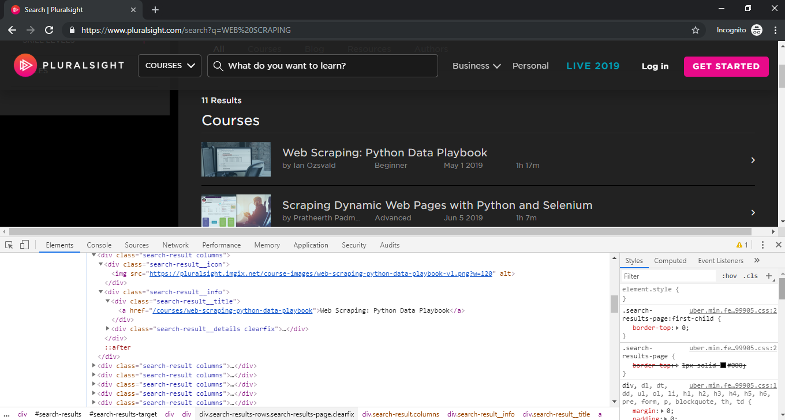
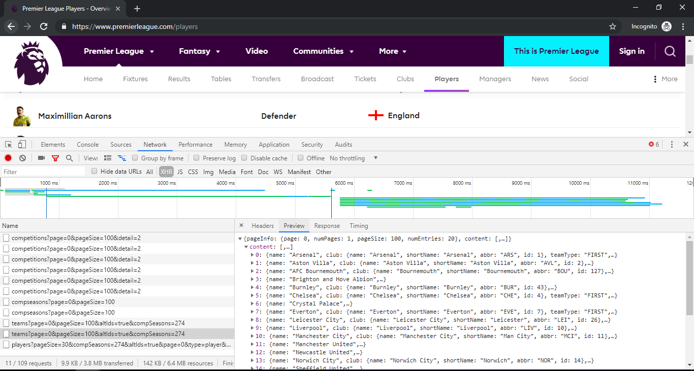

# Advanced Web Scraping Tactics

From https://www.pluralsight.com/guides/advanced-web-scraping-tactics-python-playbook By Gaurav Singhal


## Introduction

Web Scraping is a technique to extract the data from the web pages but in  an automated way. A web scraping script can load and extract the data from multiple pages  based on the requirements. Obtaining data manually from the browser is a tedious task, so it's better to do it in an automated manner.

This guide will walk you through how to handle unconventional issues and  complexities that you may come across while doing Advanced Web Scraping. This guide will cover the complexities of web scraping, along with how  to tackle them.

If you are a beginner to web scraping with Python, check out my guides on [Extracting Data from HTML with BeautifulSoup](https://www.pluralsight.com/guides/extracting-data-html-beautifulsoup) and [Crawling the Web with Python and Scrapy](https://www.pluralsight.com/guides/crawling-web-python-scrapy).


## Choose the Right Tool

Choosing the right tool depends on the type of project you are working on, since Python has a wide variety of libraries and frameworks for web scraping. So it is your responsibility to choose the best one for your project.

I believe knowing the pros and cons of a tool helps in choosing the best  tool for your project, which helps in doing effective planning that may  save you hours upfront.

Python is known for  its famous and popular libraries and frameworks in web scraping. The  three most popular tools for web scraping are:

- **BeautifulSoup**: Beautiful soup is a library for parsing HTML and XML documents. [Requests](https://2.python-requests.org/en/master/) (handles HTTP sessions and makes HTTP requests) in combination with [BeautifulSoup](https://www.crummy.com/software/BeautifulSoup/bs4/doc/) (a parsing library) are the best package tools for small and quick web  scraping. For scraping simpler, static, less-JS related complexities,  then this tool is probably what you’re looking for. If you want to know more about BeautifulSoup, please refer to my  previous guide on [Extracting Data from HTML with BeautifulSoup](https://www.pluralsight.com/guides/extracting-data-html-beautifulsoup).

  > [lxml](https://lxml.de/index.html) is a high-performance, straightforward, fast, and feature-rich parsing library which is another prominent alternative to *BeautifulSoup*.

- **Scrapy**: Scrapy is a web crawling framework that provides a complete tool for  scraping. In Scrapy, we create Spiders which are python classes that  define how a particular site/sites will be scrapped. So, if you want to  build a robust, concurrent, scalable, large scale scraper, then Scrapy  is an excellent choice for you. Also, Scrapy comes with a bunch of  middlewares for cookies, redirects, sessions, caching, etc. that helps  you to deal with different complexities that you might come across. If you want to know more about Scrapy, please refer to my previous guide on [Crawling the Web with Python and Scrapy](https://www.pluralsight.com/guides/crawling-web-python-scrapy).

- **Selenium** For heavy-JS rendered pages or very sophisticated websites, Selenium  webdriver is the best tool to choose. Selenium is a tool that automates  the web-browsers, also known as a web-driver. With this, you can open a  Google Chrome/Mozilla Firefox automated window, which visits a URL and  navigates on the links. However, it is not as efficient as the tools  which we have discussed so far. This tool is something to use when all  doors of web scraping are being closed, and you still want the data  which matters to you. If you want to know more about Selenium, please refer to [Web Scraping with Selenium](https://www.pluralsight.com/guides/web-scraping-with-selenium).


## Dynamic Pages or Client-Side Rendering

Although websites are increasingly becoming interactive and user-friendly, this has the reverse effect on web crawlers.

Nowadays, modern websites use a lot of dynamic coding practices which are not at  all crawler friendly. Some of the examples are lazy image loading,  infinite scrolling, or elements loaded via AJAX calls, which makes it  difficult to crawl even for Googlebot.

Modern websites heavily rely on JavaScript to load dynamic elements.

### How to Know if It Is Dynamic Page or Static Page?

You can detect if a web pages uses asynchronous loading or if it is a  dynamic page by viewing the page source (if you right click on the page, you will find option *View Page Source*). If, upon searching the content you are looking for, you cannot find it then it is probable  that Javascript renders the content.

Modern websites are Javascript rendered pages which makes them difficult for web scrapers.

### How Does the Webdriver Handle Dynamic Pages?

The Selenium WebDriver is one of the most popular tools for Web UI  Automation. It allows for the automatic execution of the actions  performed in a web browser window like navigating to a website, filling  out forms (including dealing with text boxes, radio buttons, and  drop-downs), submitting the forms, browsing through web pages, handling  pop-ups, and so on.

Let us take an example of scraping a dynamic site like [Pluralsight](https://www.pluralsight.com/). In this example, we will be scraping the courses available for the given keyword.



> For Selenium, you need to download the Chrome webdriver from [here](http://chromedriver.chromium.org/downloads) and you need to place the webdriver in the location of your Python script. Also, install the *selenium* Python package, if it is not already installed.

```shell
pip install selenium
```

shell

The approach for getting the list of courses is to write the keyword in the input box and then press the Enter key (but in an automated manner)  that will navigate to the course list page. Then we can use *BeautifulSoup* for parsing the content. The steps are mentioned in the code itself.

So, the script would be:

```python
# pluralsight.py
from bs4 import BeautifulSoup
from selenium import webdriver
from selenium.webdriver.chrome.options import Options
from selenium.webdriver.common.keys import Keys
from selenium.webdriver.support.ui import WebDriverWait
from selenium.common.exceptions import TimeoutException


def configure_driver():
    # Add additional Options to the webdriver
    chrome_options = Options()
    # add the argument and make the browser Headless.
    chrome_options.add_argument("--headless")
    # Instantiate the Webdriver: Mention the executable path of the webdriver you have downloaded
    # For linux/Mac
    # driver = webdriver.Chrome(options = chrome_options)
    # For windows
    driver = webdriver.Chrome(executable_path="./chromedriver.exe", options = chrome_options)
    return driver


def getCourses(driver, search_keyword):
    # Step 1: Go to pluralsight.com, category section with selected search keyword
    driver.get(f"https://www.pluralsight.com/search?q={search_keyword}&categories=course")
    # wait for the element to load
    try:
        WebDriverWait(driver, 5).until(lambda s: s.find_element_by_id("search-results-category-target").is_displayed())
    except TimeoutException:
        print("TimeoutException: Element not found")
        return None

    # Step 2: Create a parse tree of page sources after searching
    soup = BeautifulSoup(driver.page_source, "lxml")
    # Step 3: Iterate over the search result and fetch the course
    for course_page in soup.select("div.search-results-page"):
        for course in course_page.select("div.search-result"):
            title_selector = "div.search-result__info div.search-result__title a"
            author_selector = "div.search-result__details div.search-result__author"
            level_selector = "div.search-result__details div.search-result__level"
            length_selector = "div.search-result__details div.search-result__length"
            print({
                "title": course.select_one(title_selector).text,
                "author": course.select_one(author_selector).text,
                "level": course.select_one(level_selector).text,
                "length": course.select_one(length_selector).text,
            })

# create the driver object.
driver = configure_driver()
search_keyword = "Web Scraping"
getCourses(driver, search_keyword)
# close the driver.
driver.close()
```

python

Run the above python code:

```shell
python pluralsight.py
```

shell

You should get the output as follows:

```shell
...
{'title': 'Web Scraping: Python Data Playbook', 'author': 'by Ian Ozsvald', 'level': 'Beginner', 'length': '1h 17m'}
{'title': 'Scraping Dynamic Web Pages with Python and Selenium', 'author': 'by Pratheerth Padman', 'level': 'Advanced', 'length': '1h 7m'}
{'title': 'Extracting Structured Data from the Web Using Scrapy', 'author': 'by Janani Ravi', 'level': 'Beginner', 'length': '1h 52m'}
...
```

shell

### Handling AJAX Loading and Infinite Loading

Sometimes, fetching content from dynamic sites is actually straightforward, as  they are highly dependent on API calls. In asynchronous loading, most of the time, data is loaded by making GET and POST requests; you can watch these API calls in the Network tab of Developer Tools.



In the above network tab, you will get all the information regarding the request URL, required params, and header information.

Let's take a look at an example of extracting the information of the players from [Premier League](https://www.premierleague.com/). Make sure that you provide the headers and other required information  accurately. If you don't provide the headers and additional information  correctly, then it is possible that you might get an HTTP status code of *401*, *403*, etc. instead of a *200* response from the server

```python
import requests
import json

# API url
url = "https://footballapi.pulselive.com/football/players"

# Headers required for making a GET request
# It is a good practice to provide headers with each request.
headers = {
    "content-Type": "application/x-www-form-urlencoded; charset=UTF-8",
    "DNT": "1",
    "Origin": "https://www.premierleague.com",
    "Referer": "https://www.premierleague.com/players",
    "User-Agent": "Mozilla/5.0 (Windows NT 10.0; Win64; x64) AppleWebKit/537.36 (KHTML, like Gecko) Chrome/75.0.3770.100 Safari/537.36"
}

# Query parameters required to make get request
queryParams = {
    "pageSize": 32,
    "compSeasons": 274,
    "altIds": True,
    "page": 0,
    "type": "player",
    "id": -1,
    "compSeasonId": 274
}

# Sending the request with url, headers, and query params
response = requests.get(url = url, headers = headers, params = queryParams)

# if response status code is 200 OK, then
if response.status_code == 200:
    # load the json data
    data = json.loads(response.text)
    # print the required data
    for player in data["content"]:
        print({
            "name": player["name"]["display"],
            "nationalTeam": player["nationalTeam"]["country"],
            "position": player["info"]["positionInfo"]
        })
```

python

It is better to inspect the Network's tab before heading to the Selenium  WebDriver choice, because calling an API is very fast compared to  handling it with a webdriver.

If it does not work for you, then you have to use the Selenium webdriver.


## Honeypot Traps

Some website developers put honeypot traps in the form of links which are  not visible to the typical user on the browser. The easiest way to set  the honeypot is by setting the CSS as `display: none`. Since the web crawler script does not operate the way a human does, it  can try to scrape the information from the link. As a result, the  website detects the scraping and blocks the source IP address.

This detection is not easy and requires a significant amount of programming work to accomplish correctly.


## Authentication

Sometimes we need to scrape private data, which is available once you get authenticated on the website.

For more straightforward websites, we can make a *POST* request with user credentials and store that into the cookie. However, there can also be some problems, such as:

- **Hidden Inputs**: Sometimes you need to provide some additional data like *CSRF_TOKEN* along with username and password.
- **Additional Header Information**: It might be possible that you need to give some other headers before making a *POST* request.

If anything goes wrong while making an authentication *POST* request, you may get an HTTP status code of *401*, *403*, etc. instead of *200*.

### Authentication Handling

For authentication, we can maintain cookies for content that can persist  from the login. We can do this by creating sessions which can take care  of this.

The easiest way to handle authentication is by using a **webdriver**. We can automate with a *webdriver* using the **Selenium** library in python, which can manage this like a charm!


## Captcha

Captcha is a type of challenge-response test used in computing to determine  whether or not the user is human, and it is quite popular these days for keeping spammers away.

When captchas are  present on the page where you want to scrape the data, the basic setup  of scraping will inevitably fail because itn cannot pass the barrier of  captchas. To get rid of the Captchas, you may require middleware which can solve  the captchas.

Web services like *Cloudflare* prevent bots and provide DDoS protection services, which makes it even harder for bots to perform their tasks.

### Handling Redirects and Captchas

The Python Requests Library takes care of your HTTP redirects by following them and then returning to the final page. Scrapy also has a powerful way to handle redirects: you can set the redirect middleware to handle redirects.

If you are tired of handling redirect and captchas, you can also use [Crawlera](https://scrapinghub.com/crawlera) in your Scrapy project.

Simple text-based captchas can be solved by using OCR (optical character recognition); you can use [pytesseract](https://github.com/madmaze/pytesseract) python library for solving captchas.

Solving captchas is considerable overhead in the scraping process, so if you  want to get rid of this overhead, you can employ the help of APIs such  as [Anti Captcha](https://anti-captcha.com) and [Death by Captcha](https://www.deathbycaptcha.com).


## IP Blocking

IP address blocking is another common issue that a web crawler faces. If  you are making the request more often to the website with the same IP,  then there is a higher chance that the site will block your IP address.

Some websites use anti-scraping technologies which makes the site hard to scrape. *LinkedIn* is an excellent example of this.

### Avoid IP Blocking

The best way to avoid IP blocking is by regularly rotating your identity,  i.e. your IP address. It is always better to rotate IP's and use proxy  services and VPN services so that your spider won't get blocked. It will help to minimize the danger of getting trapped and getting blacklisted.

Rotating IP's is an effortless job, if you are using Scrapy. Scrapy gives you an option to include the proxies in your spider.  If you are looking for free proxies, you can get them from [here](https://free-proxy-list.net/).

There are a lot of API's available to handle IP blocking such as [scraperapi](https://www.scraperapi.com/) which you can easily integrate into your scraping project.


## Frequent Changes in the Structure

While scraping, we generally process the HTML directly by extracting contents from specific, identifiable parts of your HTML page. Web developers try to change the structure of the HTML so that it becomes difficult to  identify the selector for the information you want. They do this by  changing the IDs and classes of elements in the HTML, perhaps even  automatically.

Additionally, web developers  quest to improve the user experience and add new features. So, web pages may undergo a lot of structural changes quite often.

Some web developers also try to screw the web scrapers by inserting fake  data and leaving the old markup with the old IDs and classes in it, hide it with CSS, and fill it with false data, thereby poisoning the  scraper.

For example, The landing page of [Plurasight](https://www.pluralsight.com) has the following HTML snippet.

```html
<div class="hero">
  <h3 class="hero-title">Visit example.com for more course</h3>
  <p class="hero-description">You should visit the example.com. It is awesome!!</p>
  <a class = "hero-btn" href="https://www.example.com/buy">Visit us Now!!</a>
</div>
```

html

Here's how the search results page could be changed:

```html
<div class="real-hero">
  <h3 class="real-hero-title">Right place.Right Tech skills</h3>
  <p class="real-hero-description">With our platform, you can quantify your skills, grow in your role and stay relevant on critical topics.</p>
  <a class = "real-hero-btn" href="https://www.pluralsight.com/buy">Start a free 10-day trial</a>
</div>

<div class="hero" style="display: none">
  <h3 class="hero-title">Visit example.com for more course</h3>
  <p class="hero-description">You should visit the example.com. It is awesome!!</p>
  <a class = "hero-btn" href="https://www.example.com/buy">Visit us Now!!</a>
</div>
```


## Conclusion

I Hope this guide has helped in understanding the different traps and  roadblocks that you may face during web scraping. I believe that this  guide will help you in figuring out smart and sensible ideas to work  around and understand web scraping in-depth. If you have any queries  regarding this topic, feel free to contact me at [CodeAlphabet](https://codealphabet.com/contact). 

For more guides on scraping and Python, check out Pluralsight [Guides](https://www.pluralsight.com/guides).